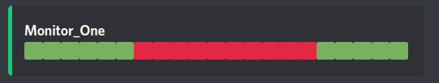
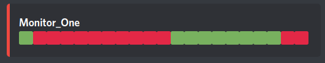

## Setup:

**Prerequirements (no Docker):**

> - Nodejs installed
> - MongoDB installed

**Prerequirements (with Docker):**

(Still needs Nodejs installed!)

Run the command 

```console
npm run dc:up
```

to start a MongoDB Container so you dont have to insall MongoDB. To stop it run

```console
npm run dc:down
```

**Steps:**

1. Rename `example.env` to `.env` and fill in your config values
    
    ```console
    mv example.env .env
    ```
    (command for unix systems)

<br>

2. Set up the monitoring. 
    
    > Rename `monitors.example.json` to `monitors.json` and configure your monitor(s).

<br>

3. Install dependencies
    
    ```console
    npm install
    ```
<br>

4. Run the Bot
    
    ```console
    npm start
    ```
<br>

## Commands:

Theres only one command: 

`statusmsg` 

Use it to post a statusmessage in the channel of your choosing (the message will be posted in the channel where you send the command). This message will then be updated continiously.


## Screenshots:

**Service available:**



**Service unavailable:**

